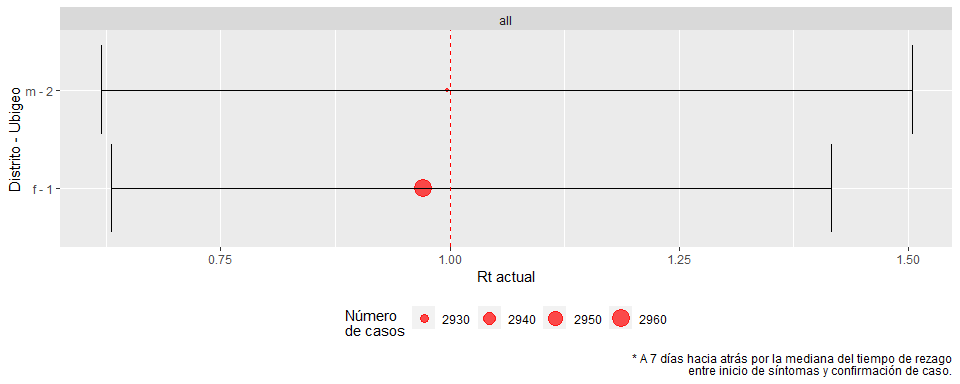

<!-- README.md is generated from README.Rmd. Please edit that file -->

# incidenceflow

<!-- badges: start -->

[](https://www.tidyverse.org/lifecycle/#experimental)
[](https://cran.r-project.org/package=incidenceflow)
<!-- badges: end -->

The goal of `incidenceflow` is to provide tidy workflows using
`incidence` and `EpiEstim` with `tidyverse` and `purrr`.

## Installation

<!-- You can install the released version of incidenceflow from [CRAN](https://CRAN.R-project.org) with: -->

``` r
if(!require("remotes")) install.packages("remotes")
remotes::install_github("avallecam/incidenceflow")
```

## Example

Here are two basic examples which shows you how to solve common
problems:

``` r
library(incidenceflow)
## basic example code
```

### Workflow 01

  - `get_info_tidy`: generates a tibble of `incidence::get_info()`.
    [clink here for more
    information](https://www.repidemicsconsortium.org/incidence/index.html).
  - `tidy_incidence`: generates a complete summary tibble from incidence
    fit paramteter estimates
  - `glance_incidence`: generates a complete summary tibble from
    incidence fit model performance

<!-- end list -->

``` r
# packages ----------------------------------------------------------------

if(!require("devtools")) install.packages("devtools")
# if(!require("avallecam")) devtools::install_github("avallecam/avallecam") #improvements

library(tidyverse) #magrittr and purrr packages
library(lubridate) #ymd
library(outbreaks) #sample data
library(incidence) #core functions

# example outbreak --------------------------------------------------------

dat <- ebola_sim$linelist$date_of_onset
i.7 <- incidence(dat, interval=7)
# plot(i.7)
f1 <- fit(i.7[1:20])
f2 <- fit_optim_split(i.7)

# broom like functions ----------------------------------------------------

# tidy
f1 %>% tidy_incidence()
#> # A tibble: 2 x 5
#>   mark  parameter estimate conf_lower conf_upper
#>   <chr> <chr>        <dbl>      <dbl>      <dbl>
#> 1 1     r           0.0318     0.0260     0.0376
#> 2 1     doubling   21.8       18.5       26.7
f2 %>% pluck("fit") %>% tidy_incidence()
#> # A tibble: 4 x 5
#>   mark   parameter estimate conf_lower conf_upper
#>   <chr>  <chr>        <dbl>      <dbl>      <dbl>
#> 1 before r           0.0298     0.0261    0.0336 
#> 2 after  r          -0.0102    -0.0110   -0.00930
#> 3 before doubling   23.2       20.7      26.6    
#> 4 after  halving    68.2       62.9      74.5

# glance
f1 %>% glance_incidence()
#> # A tibble: 1 x 11
#>   r.squared adj.r.squared sigma statistic  p.value    df logLik   AIC   BIC
#>       <dbl>         <dbl> <dbl>     <dbl>    <dbl> <int>  <dbl> <dbl> <dbl>
#> 1     0.880         0.874 0.498      133. 9.81e-10     2  -13.4  32.8  35.7
#> # ... with 2 more variables: deviance <dbl>, df.residual <int>
f2 %>% pluck("fit") %>% glance_incidence()
#> # A tibble: 2 x 12
#>   names r.squared adj.r.squared sigma statistic  p.value    df logLik   AIC
#>   <chr>     <dbl>         <dbl> <dbl>     <dbl>    <dbl> <int>  <dbl> <dbl>
#> 1 befo~     0.922         0.919 0.455      273. 2.95e-14     2  -14.8  35.5
#> 2 after     0.951         0.949 0.155      578. 3.72e-21     2   15.4 -24.8
#> # ... with 3 more variables: BIC <dbl>, deviance <dbl>, df.residual <int>


# using purrr -------------------------------------------------------------

# using purrr::map family function allows easy stratification
# for gender and could be extrapolated to administrative levels
# in country level analysis

incidence_purrr <- ebola_sim$linelist %>% 
  as_tibble() %>% 
  #filter observations explicitly before incidence()
  filter(date_of_onset<lubridate::ymd(20141007)) %>% 
  #stratify by any group of covariates
  group_by(gender) %>% 
  nest() %>% 
  mutate(incidence_strata=map(.x = data,
                              .f = ~incidence(.x %>% pull(date_of_onset),
                                              interval=7))) %>% 
  mutate(strata_fit=map(.x = incidence_strata,
                        .f = possibly(fit,NA_real_)
                        )) %>% 
  mutate(strata_fit_tidy=map(.x = strata_fit,
                                  .f = possibly(tidy_incidence,tibble()))) %>% 
  mutate(strata_fit_glance=map(.x = strata_fit,
                                       .f = possibly(glance_incidence,tibble())))

# keep only the tibbles
incidence_purrr_tibble <- incidence_purrr %>% 
  select(-data,-incidence_strata,-strata_fit)

# tidy_incidence output
incidence_purrr_tibble %>% 
  unnest(cols = c(strata_fit_tidy))
#> # A tibble: 4 x 7
#> # Groups:   gender [2]
#>   gender mark  parameter estimate conf_lower conf_upper strata_fit_glance
#>   <fct>  <chr> <chr>        <dbl>      <dbl>      <dbl> <list>           
#> 1 f      1     r           0.0228     0.0189     0.0267 <tibble [1 x 11]>
#> 2 f      1     doubling   30.3       25.9       36.6    <tibble [1 x 11]>
#> 3 m      1     r           0.0241     0.0188     0.0294 <tibble [1 x 11]>
#> 4 m      1     doubling   28.7       23.6       36.8    <tibble [1 x 11]>

# glance_incidence output
incidence_purrr_tibble %>% 
  unnest(cols = c(strata_fit_glance))
#> # A tibble: 2 x 13
#> # Groups:   gender [2]
#>   gender strata_fit_tidy r.squared adj.r.squared sigma statistic  p.value
#>   <fct>  <list>              <dbl>         <dbl> <dbl>     <dbl>    <dbl>
#> 1 f      <tibble [2 x 5~     0.859         0.853 0.510     146.  1.05e-11
#> 2 m      <tibble [2 x 5~     0.795         0.786 0.657      89.0 2.26e- 9
#> # ... with 6 more variables: df <int>, logLik <dbl>, AIC <dbl>, BIC <dbl>,
#> #   deviance <dbl>, df.residual <int>
```

#### Rus this as a `learnr` tutorial

``` r
# install package
if(!require("remotes")) install.packages("remotes")
remotes::install_github("avallecam/incidenceflow")
# install learner and run tutorial
if(!require("learnr")) install.packages("learnr")
learnr::run_tutorial(name = "taller",package = "incidenceflow")
```

### Workflow 02

  - `create_nest_dynamics`: estimate Rt per strata
  - `create_nest_summary`: create figure and tables of incidence and Rt

<!-- end list -->

``` r
linelist_raw <- ebola_sim$linelist %>% 
  as_tibble() %>% 
  #filter observations explicitly before incidence()
  # filter(date_of_onset<lubridate::ymd(20141007)) %>% 
  mutate(all="all")

dictionary <- linelist_raw %>% 
  count(all,gender) %>% 
  rownames_to_column(var = "code")

# linelist_raw %>% 
#   group_by(gender) %>% 
#   skimr::skim()
```

``` r
time_delay_set = 7
#### execute -------------------------------

nest_dynamics <- create_nest_dynamics(linelist = linelist_raw,
                                      dictionary = dictionary,
                                      strata_major = all,
                                      strata_minor = gender,
                                      strata_minor_code = code, # unico para diccionario
                                      date_incidence_case = date_of_onset,
                                      date_of_analysis_today=FALSE,
                                      issue_number_set = 0)

nest_dynamics #%>% glimpse()
#> # A tibble: 2 x 17
#>   strata_major strata_minor strata_minor_co~ data  n_pre_clean n_pos_clean
#>   <chr>        <fct>        <chr>            <lis>       <int>       <int>
#> 1 all          f            1                <tib~        2962        2962
#> 2 all          m            2                <tib~        2926        2926
#> # ... with 11 more variables: one_incidence_tidy <list>,
#> #   one_incidence_glance <list>, date_split_peak <date>,
#> #   date_firstone <date>, date_lastone <date>, date_lastlag_days <date>,
#> #   incidence_fit_figure <list>, tsibble_rt <list>, current_rt <list>,
#> #   last5wk_rt <list>, rt_figure <list>
```

``` r
#### nested figures -------------------------------
nest_summary <- create_nest_summary(nest_dynamics = nest_dynamics,
                                    time_limit_fig02 = Inf)

nest_summary #%>% glimpse()
#> # A tibble: 1 x 9
#>   strata_major data     fig01  fig02  fig03 tab01   tab02   tab03   tab04  
#>   <chr>        <list>   <list> <list> <lis> <list>  <list>  <list>  <list> 
#> 1 all          <tibble~ <gg>   <gg>   <gg>  <tibbl~ <tibbl~ <tibbl~ <tibbl~
```

``` r
#### if a shapefile is available ----------------------
# nest_summary <- create_nest_summary_map(nest_dynamics = nest_dynamics,
#                                                    geometry = ubigeo_geometria_per2,
#                                                    strata_major=nm_pais,
#                                                    strata_minor=nm_depa)
```

``` r
#### if you want to write it -------------------------
# rt_write_rds(nest_summary = nest_summary,
#              rute = "",
#              name = "admx")
```

``` r
region_name <- "all"

nest_summary %>% 
  filter(strata_major==region_name) %>% 
  pull(fig01) %>% pluck(1)
```


``` r
nest_summary %>% 
  filter(strata_major==region_name) %>% 
  pull(fig02) %>% pluck(1)
```


``` r
nest_summary %>% 
  filter(strata_major==region_name) %>% 
  pull(fig03) %>% pluck(1)
```



``` r
# nest_summary %>% 
#   filter(strata_major==region_name) %>% 
#   pull(fig04) %>% pluck(1)

nest_summary %>% 
  filter(strata_major==region_name) %>% 
  pull(tab01) %>% pluck(1)
#> # A tibble: 8 x 8
#>   strata_minor strata_minor_co~ mark  parameter estimate conf_lower
#>   <fct>        <chr>            <chr> <chr>        <dbl>      <dbl>
#> 1 f            1                befo~ growth_r~  0.0212      0.0194
#> 2 f            1                after growth_r~ -0.00958    -0.0104
#> 3 f            1                befo~ doubling  32.7        30.2   
#> 4 f            1                after halving   72.3        66.8   
#> 5 m            2                befo~ growth_r~  0.0214      0.0195
#> 6 m            2                after growth_r~ -0.0101     -0.0111
#> 7 m            2                befo~ doubling  32.3        29.7   
#> 8 m            2                after halving   68.4        62.4   
#> # ... with 2 more variables: conf_upper <dbl>, date_split_peak <date>
nest_summary %>% 
  filter(strata_major==region_name) %>% 
  pull(tab02) %>% pluck(1)
#> # A tibble: 4 x 6
#>   strata_minor strata_minor_code names  r.squared adj.r.squared  p.value
#>   <fct>        <chr>             <chr>      <dbl>         <dbl>    <dbl>
#> 1 f            1                 before     0.800         0.798 2.32e-50
#> 2 f            1                 after      0.735         0.734 2.39e-61
#> 3 m            2                 before     0.790         0.788 1.56e-46
#> 4 m            2                 after      0.673         0.672 6.03e-51
nest_summary %>% 
  filter(strata_major==region_name) %>% 
  pull(tab03) %>% pluck(1)
#> # A tibble: 2 x 6
#>   strata_minor strata_minor_co~ date_rt    rt_estimate rt_conf.lower
#>   <fct>        <chr>            <date>           <dbl>         <dbl>
#> 1 f            1                2015-04-17       0.971         0.631
#> 2 m            2                2015-04-17       0.997         0.619
#> # ... with 1 more variable: rt_conf.upper <dbl>
nest_summary %>% 
  filter(strata_major==region_name) %>% 
  pull(tab04) %>% pluck(1)
#> # A tibble: 2 x 7
#>   strata_minor strata_minor_co~ `2015-W11` `2015-W12` `2015-W13` `2015-W14`
#>   <fct>        <chr>            <chr>      <chr>      <chr>      <chr>     
#> 1 f            1                1.03(0.71~ 0.99(0.68~ 0.93(0.62~ 0.97(0.62~
#> 2 m            2                0.95(0.65~ 0.88(0.55~ 1.04(0.69~ 0.97(0.62~
#> # ... with 1 more variable: `2015-W15` <chr>
```

## Updated approaches

  - on incidence: <https://github.com/reconhub/incidence2>

  - on time-varying transmission: <https://epiforecasts.io/EpiNow2/>
